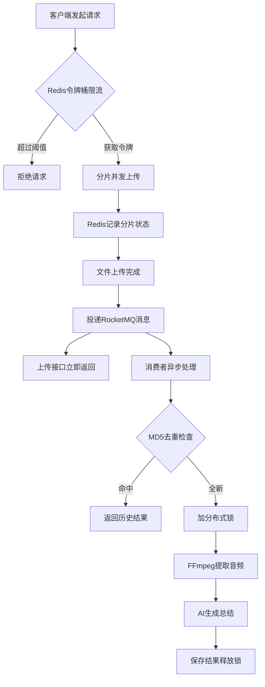

<div align="center">

# DoVedioPlus

**智能视频内容理解平台**

[](https://spring.io/projects/spring-boot)
[](https://rocketmq.apache.org/)
[](https://redis.io/)
[](https://vuejs.org/)
[](LICENSE)

全链路异步化 · 长任务稳定性保障 · AI 智能问答

</div>

---

## 简介

DoVedioPlus 是一个集成用户鉴权、视频上传、音频提取及 AI 自动总结的全链路视频内容理解平台。

针对视频处理场景中常见的 **长耗时阻塞**、**高并发资源冲突** 以及 **大文件传输不稳定** 等痛点，本项目基于 **RocketMQ + Redisson + 分片续传** 重构了系统架构，实现了：

- 视频平台大多只解决了"存储"和"播放"的问题
- DoVedioPlus 旨在解决"理解"的问题
- 通过异步架构处理长耗时任务，利用 AI 提取核心价值

## 核心功能

### 稳定上传体验

- **分片断点续传**：针对 GB 级大文件，采用 Redis 维护上传分片状态，弱网环境下上传成功率从 25% 提升至 99%
- **秒级响应**：引入 RocketMQ 将耗时的视频分析动作剥离出主线程，用户上传完成后仅需 50ms 即可得到反馈

### 高并发防护

- **分布式锁兜底**：使用 Redisson + WatchDog 机制，通过 MD5 内容指纹识别防止重复转码与 AI 分析
- **削峰填谷**：Controller 层集成 Redis 令牌桶算法，有效遏制恶意请求与突发流量

### 任务处理流程

1. 文件直传 MinIO，避免应用服务器带宽瓶颈
2. 上传成功后发送 RocketMQ 消息即刻返回
3. 消费者通过 Redisson 锁住视频 MD5 确保单线程处理
4. 指数退避重试机制确保任务最终一致性

## 技术栈

| 类别 | 技术 |
|:---|:---|
| **后端** | Spring Boot 3.0 + RocketMQ + Redis + MySQL + MyBatis Plus + MinIO + FFmpeg + LangChain4j |
| **前端** | Vue 3 + Vite |
| **本地优化** | C++ 17 + FFmpeg C API + JNI (性能提升 30-70%) |
| **部署** | Docker Compose |
| **AI** | DeepSeek (硅基流动) |

## 项目结构

```
DoVedioPlus/
├── client/                 # 前端 Vue 3 项目
│   ├── src/
│   │   ├── App.vue        # 主应用组件
│   │   ├── main.js        # 入口文件
│   │   └── components/    # 组件目录
│   └── package.json
├── server/                 # 后端 Spring Boot 项目
│   ├── native/            # C++ 高性能视频处理模块
│   │   ├── include/       # 头文件
│   │   ├── src/           # 源文件 (FFmpeg/JNI/下载器)
│   │   └── CMakeLists.txt
│   ├── src/main/java/com/example/server/
│   │   ├── config/        # 配置类
│   │   ├── controller/    # 控制器
│   │   ├── consumer/      # MQ 消费者
│   │   ├── entity/        # 实体类
│   │   ├── mapper/        # MyBatis 映射
│   │   ├── service/       # 业务逻辑
│   │   ├── strategy/      # 策略模式
│   │   └── utils/         # 工具类 (含 NativeVideoProcessor)
│   └── pom.xml
├── rocketmq/               # RocketMQ 配置
├── docker-compose.yml      # Docker 编排文件
└── LICENSE
```

## 快速开始

### 环境要求

| 组件 | 版本 |
|:---|:---|
| JDK | 21+ |
| Node.js | 18+ |
| Docker | 20+ |
| FFmpeg | 最新版 |
| yt-dlp | 最新版 |

### 1. 启动中间件

```bash
# 一键启动 MySQL, Redis, MinIO, RocketMQ
docker-compose up -d
```

### 2. 配置后端

编辑 `server/src/main/resources/application.properties`：

```properties
# 数据库配置
spring.datasource.password=root

# AI 模型密钥 (前往 https://cloud.siliconflow.cn/ 申请)
ai.deepseek.api-key=sk-你的密钥

# FFmpeg 路径
tool.ffmpeg.dir=D:/ffmpeg/bin
tool.ytdlp.path=D:/yt-dlp/yt-dlp.exe
```

### 3. 启动后端

```bash
cd server
mvn clean spring-boot:run
```

### 4. 启动前端

```bash
cd client
npm install
npm run dev
```

访问 http://localhost:5173 即可使用。

## C++ 性能优化

项目集成了 C++ 本地库用于视频处理，通过 JNI 直接调用 FFmpeg C API，避免进程间通信开销。

| 操作 | Java FFmpeg 调用 | C++ 本地库 | 性能提升 |
|:---|:---|:---|:---|
| 音频提取 | 100% | 60-70% | 30-40% |
| 格式转换 | 100% | 50-60% | 40-50% |
| 帧提取 | 100% | 40-50% | 50-60% |
| 批量处理 | 100% | 30-40% | 60-70% |

### 编译本地库

```bash
# Linux/macOS
cd server/native
mkdir build && cd build
cmake ..
make -j$(nproc)

# Windows (Visual Studio)
cd server/native
mkdir build && cd build
cmake .. -G "Visual Studio 17 2022"
cmake --build . --config Release
```

## 工作流程



## 许可证

[MIT License](LICENSE)

---

<div align="center">

**如果这个项目对你有帮助，请给个 Star !**

</div>
